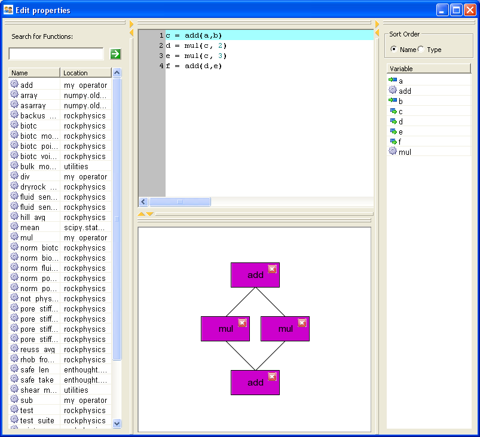

Welcome to the BlockCanvas documentation!
=========================================

Application Overview
---------------------

This application is intended to explore ideas for visually edit/run/debug
data flow networks and explore the data generated by them.

Users can see two (partially) synchronized views of the data flow.  One is the
actual python code that represents the data flow, and the other is a visual
layout of the data flow on a canvas.  The canvas is fairly simple in that it
doesn't show all the input/output ports of functions -- it simply draws a single
line between two related functions.  This is a valuable view, but we will likely
want to enhance it with a "port" view later.  Users can move components around
on the graph.  They can select multiple items with Ctrl-click, and they can move
multiple items as a group.  They can also delete functions with the "Del" key.
(The "close" icon in the corner of functions should also delete components, but
buttons are working right now.)

Contents
--------

.. toctree::
   
   readme.rst
   notes.rst

